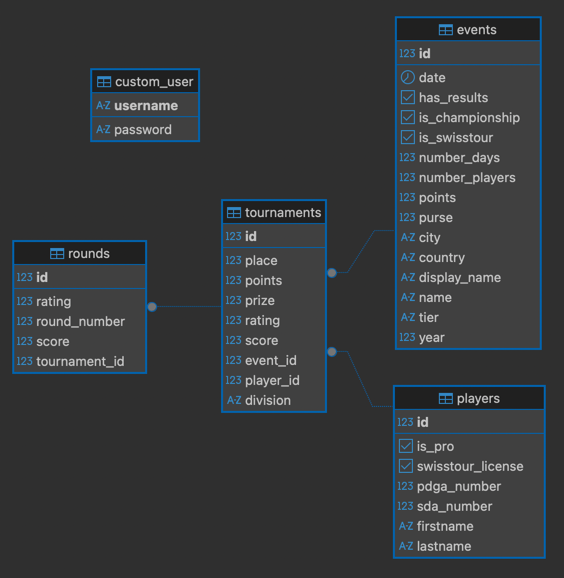

# Swiss Tour Standings Application (Backend)

README is still a work in progress...

## Initial Status & Goal

The Swiss Disc Golf Association needs an automated solution to calculate the standings for 
disc golf players, that are members of the association, as they partake in tournaments throughout 
the year. Furthermore, they desire a simplified way to summarize and communicate long 
and short-term player statistics in order to make the selection for national teams and other 
awards more transparent. Finally, they desire to improve the internal management of license tracking and
external event communication.

Until recently, the standings were calculated by manual copy and paste of results from the Professional
Disc Golf Association (PDGA) website into an Excel spreadsheet and the summary of player 
statistics was simply not possible. The management of license tracking and events has been improved 
from a stand-alone Excel spreadsheet to database tables, that seamlessly integrated with the rest of
the application's functionality. The ease of use for non-tech-savvy users has been maintained through
an intuitive web-based frontend built in Angular.

## Solution

The project features a RESTful backend service developed with Java Spring Boot (this repository), 
which manages data processing and exposes functionality through JSON-based API endpoints. 
An Angular frontend interface provides an intuitive user experience by interacting with these backend 
services.
  
## General Design

The general code structure is based on the follow pattern for each table in the database.
- A Jakarta `@Entity` class used as the database layer to define the table database columns, primary key, relationships, etc..
- A DTO class used as the data transfer layer to decouple the database model from the API representation.
- A JPA repository used as the data access layer to enable out-of-the-box SQL querying methods and a place to define custom queries.
- A resource class annotated as a Spring Web `@RestController` as a web layer to expose API endpoints.
- A service class used to decouple the business logic from the exposure of the API endpoints.

## Database
For data persistence a postgreSQL database with five tables was implemented: 
- The **events** table serves as the primary repository for event relevant information.
- The **players** table serves as the primary repository for player relevant information.
- The **tournaments** table acts as the junction, resolving the many-to-many relationship between **players** and **events**. 
Furthermore, it serves as a repository to capture nuanced player-event interactions, including
player's division for that event, prize money earned, and final tournament place.
- The **rounds** table provides a deeper level of performance tracking, breaking down tournament results into individual round performances.
  A potential future enhancement includes a **holes** table, which would offer the most granular level of performance data by tracking scores for each individual hole.
- The **user** table is simply a way to persist administrator login credentials.

## API Endpoints

Each of the resource classes are annotated as a Spring Boot @RestController and provide the following endpoints.

### Events
- `GET /api/events`
  - optional query parameters:
    - year
    - division
  - returns a list of EventDTOs
- `GET /api/events/{id}`
  - returns the EventDTO with the provided id
- `POST /api/events`
  - requires an EventDTO request body
  - returns the created EventDTO
- `POST /api/events/results/{id}`
  - scrapes the results from the PDGA website of the event with the provided id
  - returns the event id
- `PUT /api/events/{id}`
  - requires an EventDTO request body
  - returns the updated EventDTO
- `DELETE /api/events/{id}`
  - deletes the Event with the provided id
  - returns 204 NO_CONTENT

## Data Scraping

## Security Overview

- Uses JWT-based stateless authentication.
- The following endpoints require authentication:
  - `PUT /api/events/{id}`
  - `POST /api/events/results/{id}`
  - `DELETE /api/events/{id}`
  - `POST /api/players`
  - `PUT /api/players/{id}`
  - `DELETE /api/players/{id}`
  - All other requests are permitted.

## Development

The backend (this repository) is written using Spring Boot and was initially kick-started using Bootify.io.

